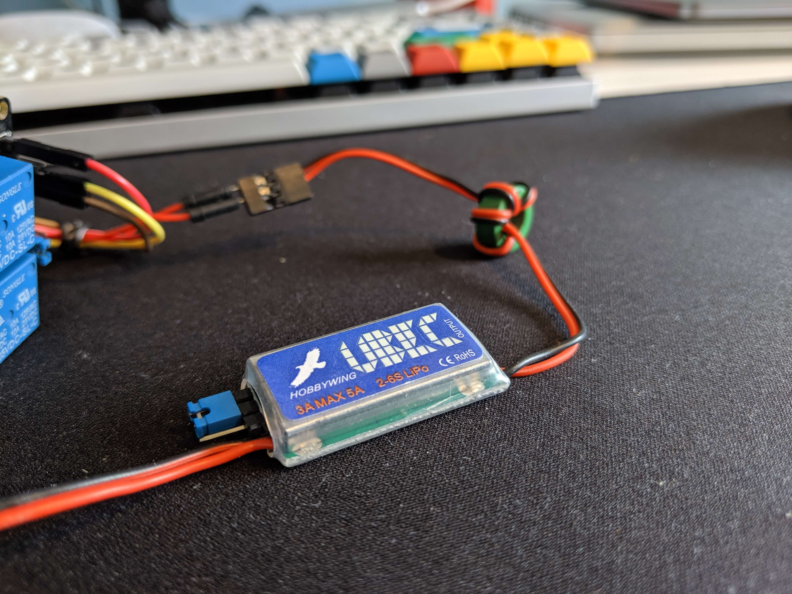

# Siren Hardware Hacking (IoT)

Aim - To use an ESP8266 chip to control an air raid siren, switching it if the surf conditions in my area match a given criteria.

## Requirements</h2>
My requirements are as follows:

- Air raid siren must be controllable by an ESP8266 chip
- The entire circuit must be powered from a single plug socket
- The ESP8266 must connect to WiFi, find a surf forecast and sound the siren if the conditions are good

## Components
In order to build the circuit which will meet my requirements I need several components:

### PWM
I will need a [Pulse Width Modulator](https://www.arduino.cc/en/Tutorial/PWM)</a>. This will enable me to drive the analog motor in the siren with digital signals.


### Relay
I will need a way in which I can break / complete the part of the circuit powering the siren in different scenarios. A [relay](https://en.wikipedia.org/wiki/Relay) is perfect for this. This relay can be controlled by the ESP8266 chip.

### Siren
Obviously the 12V air raid siren is central to this project. I found a cheap wooden box at a local DIY shop to house the circuitry, and screwed the siren to the top of it.


### UBEC
A 3 amp Universal Battery Elimination Circuit (UBEC) is a switch mode DC regulator that takes high voltage and converts it to a consistant 5/6 volts. In my case, it will allow me to use the high voltage transformer required to power the siren to power the wemos also.



### ESP-8266
The [Wemos D1 mini](https://wiki.wemos.cc/products:d1:d1_mini) is chip based on the ESP-8266. I can use this to control the relay, and therefore the siren. It has WiFi capabilities, so I can use it to check the surf forecast online.


### Transformer
I will use a transformer from a mains socket to power the entire circuit.


## The Circuit
After a lot of thought, I developed the following circuit using the various components described above.


When wired up, in real life the circuit looks like this

The transformer produces power to the Wemos via the UBEC. The UBEC ensures no more than 5/6v is supplied to the Wemos to avoid damaging it. The transformer also provides power to the PWM (which is used to control the siren) and The Wemos provides 3V to the relay. The circuit which provides power to the PWM is broken by a relay, which means that by default it will not make any noise. In addition to the circuitry shown in the above diagram, there are additional wires between the Wemos and the relay, through which the Wemos sends data. This allows the Wemos to tell the relay to close the circuit when appropriate, which in turn will sound the siren.

The actual circuit looks like this:


## Proof of concept
As a proof of concept, the following code switches the alarm on for 3 seconds, then off for 3 seconds.

```
void setup() {
    pinMode(D5, OUTPUT);
}

void alarmOn() {
  digitalWrite(D5, HIGH);
}

void alarmOff() {
  digitalWrite(D5, LOW);
}

void loop() {
  alarmOn();
  delay(3000);
  alarmOff();
  delay(3000);
}
```

[This video](./img/siren-poc.mp4) demonstrates the poc in action

## To be continued ...
The next step will be to integrate with a surf forecast API. [Magic Seaweed](https://magicseaweed.com/) have kindly provided me with a key to their API, so next steps coming soon!
